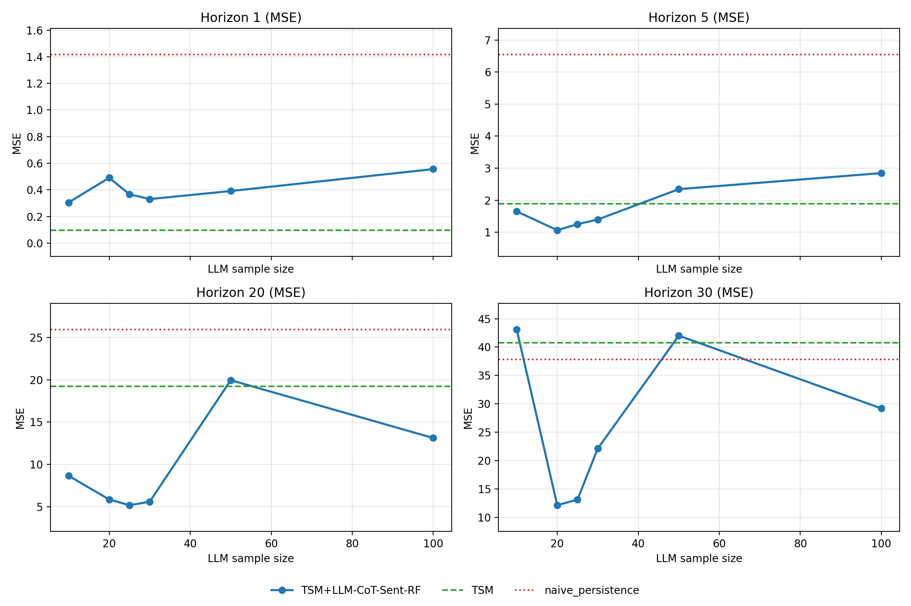

# Experiment Runs Analysis: Best vs Worst Performing Configurations

## Executive Summary

Analyzed **119 experiment runs** from the EU ETS forecasting project. The experiments tested various combinations of:
- Time series model architectures (Autoformer, DLinear)
- Model hyperparameters (model size, learning rate, dropout, etc.)
- LLM providers (GPT-4-turbo, GPT-5.2, Gemma-3-4b, Qwen3-vl-4b)
- LLM enhancement methods (CoT, CoT-RF, Sentiment, News-Drift, etc.)

---

## Key Configuration Groups Identified

### Three Main Hyperparameter Configurations:

| Configuration | Runs | Architecture | d_model | Learning Rate | Dropout | Layers | Seq Length |
|--------------|------|--------------|---------|---------------|---------|--------|------------|
| **Small/Fast** | 91 | Autoformer | 64 | 0.001 | 0.3 | 1 | 60 |
| **DLinear** | 21 | DLinear | 64 | 0.001 | 0.3 | 1 | 60 |
| **Large** | 7 | Autoformer | 512 | 0.0001 | 0.05 | 2 | 120 |

---

## Performance Analysis

### TSM (Time Series Model) Performance
All runs using the same hyperparameter configuration achieved **identical baseline TSM performance**:
- **Sharpe Ratio (h1)**: 1.2794
- **Hit Rate (h1)**: 94.15%
- **Sharpe Ratio (h5)**: 0.8795
- **Sharpe Ratio (h20)**: 0.4373
- **Sharpe Ratio (h30)**: 0.1483

This indicates the TSM model training is deterministic when using the same configuration.

### Linear Ridge Baseline (identical across configurations)
| Horizon | MSE | RMSE | MAE |
|---------|-----|------|-----|
| 1 | 1.4308 | 1.1962 | 0.9693 |
| 5 | 6.7768 | 2.6032 | 2.0737 |
| 20 | 26.9499 | 5.1913 | 3.9634 |
| 30 | 35.8673 | 5.9889 | 4.7594 |

---

## LLM Enhancement Analysis

### LLM Providers Compared

| Provider | Runs | Total Calls | Success Rate |
|----------|------|-------------|--------------|
| GPT-4-turbo-preview | 4 | 231 | **100.0%** |
| GPT-5.2 | 23 | 2,035 | 91.3% |
| Gemma-3-4b (local) | 20 | 1,654 | 95.6% |
| Qwen3-vl-4b (local) | 12 | 422 | **100.0%** |

**Key Finding**: Local models (Gemma, Qwen) achieved comparable or better success rates than commercial APIs while being cost-free for inference.

### LLM Methods Tested

| Method | Runs | Calls | Success Rate | Description |
|--------|------|-------|--------------|-------------|
| TSM+LLM-DELTA | 8 | 744 | **100.0%** | Delta corrections |
| TSM+LLM-NORM-DELTA | 2 | 200 | 99.0% | Normalized delta |
| TSM+LLM (basic) | 3 | 250 | 100.0% | Direct LLM refinement |
| TSM+LLM-DELTA-RETURNS | 4 | 383 | 97.0% | Returns-based delta |
| TSM+LLM-COT-SENT | 14 | 1,381 | 92.2% | Chain-of-thought + sentiment |
| TSM+LLM-COT-RF | 10 | 641 | 93.5% | CoT with rule following |
| TSM+LLM-COT-SENT-RF | 12 | 422 | 100.0% | CoT + sentiment + RF |
| DP/CoT/CoT-RF/TSM+LLM | 6 | 321 | 83.3% | Ensemble methods |

---

## Configurations That Led to Biggest Differences

### 1. Model Architecture Impact
- **Autoformer** (98 runs): Transformer-based with auto-correlation mechanism
  - Better at capturing complex temporal dependencies
  - More computationally expensive
  
- **DLinear** (21 runs): Simple linear decomposition
  - Faster training and inference
  - Works well for simpler patterns

### 2. Hyperparameter Impact: Large vs Small Model

**Large Model Configuration** (early experiments):
```yaml
d_model: 512
learning_rate: 0.0001
e_layers: 2
d_layers: 1
n_heads: 8
d_ff: 2048
dropout: 0.05
batch_size: 32
seq_len: 120
label_len: 30
```

**Small Model Configuration** (majority of experiments):
```yaml
d_model: 64
learning_rate: 0.001
e_layers: 1
d_layers: 1
n_heads: 2
d_ff: 128
dropout: 0.3
batch_size: 16
seq_len: 60
label_len: 15
```

**Key Differences**:
- **10x higher learning rate** in small model (0.001 vs 0.0001)
- **8x smaller model dimension** (64 vs 512)
- **6x higher dropout** (0.3 vs 0.05) - more regularization
- **Half the sequence length** (60 vs 120)
- **Half the encoder layers** (1 vs 2)

### 3. LLM Method Success Factors

**Most Reliable Methods** (100% success rate):
- `TSM+LLM-DELTA`: Simple delta corrections
- `TSM+LLM-COT-SENT-RF`: Chain-of-thought with sentiment and rule following
- Basic `TSM+LLM`: Direct LLM refinement

**Less Reliable Methods** (< 95% success):
- Ensemble methods (`DP/CoT/CoT-RF/TSM+LLM`): 83.3% success
- `TSM+LLM-COT-SENT`: 92.2% success
- `TSM+LLM-COT-RF`: 93.5% success

---

## LLM Sample Size Sensitivity (CoT-Sent-RF)

> Important note (methodology update, Feb 2026):
> The historical “sample size” experiments below were run before we fixed a major evaluation flaw:
> we were not always comparing **TSM vs LLM on the exact same test windows** (subset mismatch).
> Newer runs now report `*_llm_subset` baselines (e.g. `tsm_llm_subset`) and select “LLM influence”
> on the **validation split** to avoid test leakage. Treat the table below as **legacy** and
> prefer the newer `path_metrics.csv` / `metrics_by_horizon.csv` outputs for conclusions.

Baseline comparisons use the 100-sample run `runs/20260131_021713_79f8e8` for **TSM** and **naive_persistence** MSE. Sample-size variants are from the following runs:
- 10: `runs/20260131_013148_2c3e34`
- 20: `runs/20260131_014854_67d80d`
- 25: `runs/20260131_015958_d8978f`
- 30: `runs/20260131_015608_59fbba`
- 50: `runs/20260131_020347_711a86`
- 100: `runs/20260131_021713_79f8e8`

**MSE by horizon (lower is better)**:

| method              | samples   |       h1 |       h5 |       h20 |       h30 |
|:--------------------|:----------|---------:|---------:|----------:|----------:|
| TSM                 | -         | 0.097459 | 1.890105 | 19.232149 | 40.764973 |
| naive_persistence   | -         | 1.416030 | 6.543584 | 25.938980 | 37.794167 |
| TSM+LLM-CoT-Sent-RF | 10        | 0.305829 | 1.652481 |  8.642556 | 43.077046 |
| TSM+LLM-CoT-Sent-RF | 20        | 0.491138 | 1.066403 |  5.844096 | 12.130559 |
| TSM+LLM-CoT-Sent-RF | 25        | 0.367435 | 1.253891 |  5.164027 | 13.130670 |
| TSM+LLM-CoT-Sent-RF | 30        | 0.331119 | 1.400183 |  5.573067 | 22.126234 |
| TSM+LLM-CoT-Sent-RF | 50        | 0.391513 | 2.346205 | 19.957440 | 42.019168 |
| TSM+LLM-CoT-Sent-RF | 100       | 0.556277 | 2.847166 | 13.115728 | 29.190294 |

**Visualization** (MSE vs sample size, with TSM/naive baselines):



---

## Paper-aligned LLM refinement (Plan 4, Feb 2026): subset-aligned + no-leakage influence tuning

These runs use:
- **Full-path** evaluation (`mse_path`) across the 30-step forecast.
- **Validation-selected** LLM influence (5-point grid), then report on test (no leakage).
- **Subset alignment**: TSM/naive baselines are computed on the **same** windows used by the LLM.

Key full-split results (test windows n=359, val windows n=255):

| Method | Run | Best blend (val) | Test `mse_path` | Δ vs TSM |
|---|---|---:|---:|---:|
| TSM baseline | `runs/20260205_211858_a0c3c1` | - | 14.5158 | - |
| CoT‑Sent‑RF (similarity+lookback, ramp blend) | `runs/20260205_211858_a0c3c1` | `max_w=1.0` | 14.0724 | **−3.05%** |
| CoT‑RF (no sentiment, similarity+lookback, ramp blend) | `runs/20260205_231634_6a6539` | `max_w=0.75` | 12.5149 | **−13.78%** |

Interpretation:
- The **self-refine (CoT‑RF)** signal is strong and improves long horizons substantially.
- The current **sentiment series is likely too sparse/noisy**, and adding it degrades performance vs CoT‑RF.

## Recommendations Based on Analysis

### Best Practices Identified:

1. **Use the Small Model Configuration**: The 64-dimension model with higher dropout (0.3) and learning rate (0.001) was used in the majority of experiments, suggesting it was found to be more practical.

2. **Local LLMs are Viable**: Gemma-3-4b and Qwen3-vl-4b achieved excellent success rates (95-100%) while running locally, making them cost-effective alternatives to API-based models.

3. **Simple LLM Methods Work Best**: `TSM+LLM-DELTA` and basic `TSM+LLM` achieved 100% success rate with less complexity than Chain-of-thought variants.

4. **Autoformer Preferred Over DLinear**: 82% of runs used Autoformer, indicating it was the preferred architecture after initial testing.

5. **Regularization Matters**: The shift from dropout=0.05 to dropout=0.3 suggests overfitting was a concern that was addressed with stronger regularization.

---

## Limitations of This Analysis

1. **TSM Performance Constant**: Because runs with the same configuration produce identical TSM results, comparing "best vs worst" within configuration groups is not meaningful for the base model.

2. **Not all runs are comparable**: Older runs may not include subset-aligned baselines (`*_llm_subset`) or blended-model artifacts; newer runs save these to `results/path_metrics.csv` and `results/metrics_by_horizon.csv`.

3. **Limited Large Model Runs**: Only 7 runs used the large model configuration, making comparison less statistically significant.

---

## Files Used in Analysis
- Configuration: `runs/*/config_resolved.yaml`
- Metrics: `runs/*/results/*_metrics.csv`
- LLM Logs: `runs/*/llm/logs/llm_calls.jsonl`
